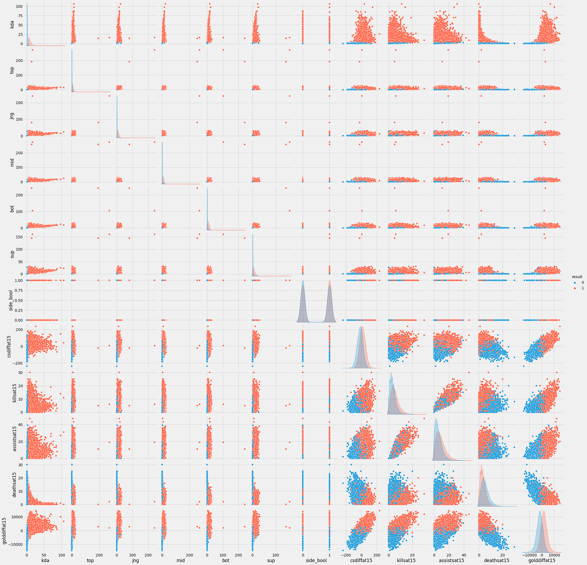
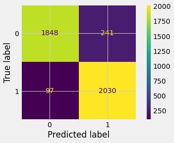

# Predicting League of Legends Win Probability

For our MVP, we have done a good portion of the EDA (2021 match data found [here](https://oracleselixir.com/tools/downloads)) for this project and are doing initial fitting and analysis of a basic logistic regression model. 

We started by selecting for a handful of high-impact stats commonly referenced in League of Legends casting and did a basic eye-test using a seaborn pairplot to evaluate these features for viability.

The features ultimately used in our initial model training are a team's:
* kda (overall/by team)
* player kda (5 features, one for each of the 5 team roles: top, jungle, mid, bot, support)
* starting side of map
* CS (creep-score) at 15 minutes
* Kills at 15
* Assists at 15
* Deaths at 15
* Gold difference between teams at 15

Using an 80-20 train-test split, we then trained our logistic regression model on the train data, and then attempted to use the model to predict game results using the test data. To evaluate our initial model, we looked at the accuracy, precision, and ROC scores, which were **0.92**, **0.89**, and **0.95**, respectively. Similarly, we created a confusion_matrix to assess the types of correct/incorrect predictions we were getting.

